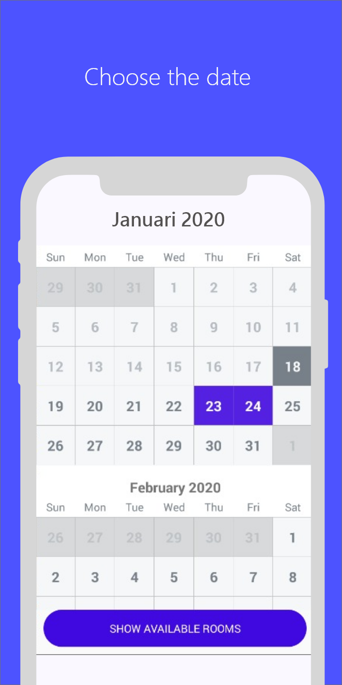

# BRUANG
***Aplikasi hanya berupa prototype dan tidak benar-banar digunakan***\
\
BRUANG adalah platform Booking Ruangan yang menawarkan media pemilihan ruangan yang kosong untuk digunakan pada Universitas Amikom. User umumnya adalah dosen
yang memerlukan ruangan untuk jam pengganti mata kuliah yang kosong atau penggantian ruangan yang sedang ditempati karena masalah teknis.

Menggunakan aplikasi BRUANG menghemat waktu karena user tidak perlu konfirmasi langsung dengan pihak pengajaran. Cukup dengan membuka aplikasi kemudian mencari ruangan kosong, lalu pilih, dan booking ruangan. Setelah itu ruangan bisa digunakan sesuai dengan jadwal ruangan yang akan dipakai.

# Penggunaan
1. Login
2. Pilih menu 'New Booking'
3. Pilih tanggal booking (bisa banyak tanggal) kemudian klik 'Show Available Rooms
4. Pilih ruangan dan tanggal dari ruangan yang tersedia pada tanggal yang dipilih sebelumnya.
5. Isi data yang dibutuhkan kemudian klik tombol 'Booking'
6. Tunggu hingga permintaan booking ruang di terima/konfirmasi oleh admin. Status booking dapat dilihat pada halaman utama (Hijau = Diterima, Kuning = Pending, Merah = Ditolak) atau halaman detail booking

# Server Aplikasi
Server aplikasi dijalankan dengan basis framework laravel dan database MySql.  
[Halaman Repository Server](https://github.com/nazililham11/bruang-laravel)
